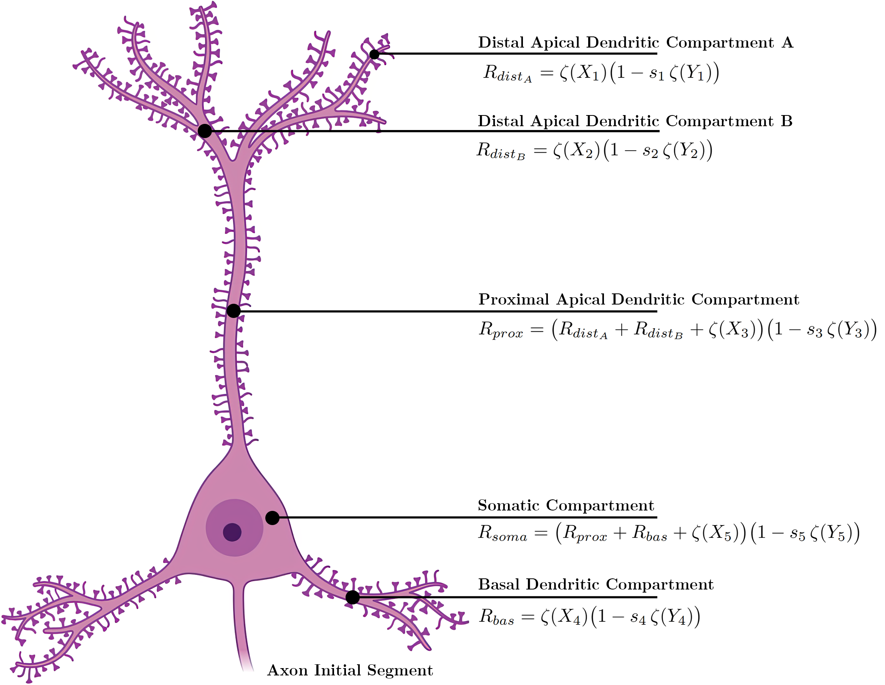

# Learning_Hippo

Questo repository contiene i risultati degli esperimenti descritti nell'articolo **"Learning Hippo: A Hippocampal Neural Architecture for Deep Learning"**. I dati sono forniti per consentire una validazione indipendente e una riproducibilità trasparente dei risultati presentati.

## Abstract
Le attuali reti neurali presentano note limitazioni a causa della loro fragilità contro i dati corrotti e della necessità di grandi quantità di dati per l'addestramento. In questo lavoro, presentiamo **Hippo-1**, un modello di neurone biologico e un'architettura specifica ispirata alla regione CA3 dell'ippocampo. Il nostro modello si basa su una semplificazione compartimentale giustificata del neurone, che ci permette di preservare l'integrazione dendritica non lineare, e su una specifica interazione tra popolazioni di neuroni eccitatori e inibitori attraverso un meccanismo di *shunting inhibition*. I risultati sperimentali dimostrano che Hippo-1 non solo raggiunge prestazioni competitive o superiori rispetto ai Multi-Layer Perceptron (MLP), ma mostra anche una robustezza superiore al rumore, con un degrado più graduale delle prestazioni all'aumentare della corruzione dell'input.

---

*Rappresentazione del modello a cinque compartimenti per un neurone piramidale di Hippo-1 con le rispettive equazioni di integrazione del segnale. Ogni equazione incorpora il meccanismo di shunting inhibition, dove un segnale eccitatorio $X_i$ è modulato moltiplicativamente da un segnale inibitorio $Y_i$.*

## L'architettura `Hippo-1`
L'obiettivo di `Hippo-1` è integrare principi neuroscientifici chiave per superare i limiti dei modelli standard, come gli MLP. L'ispirazione principale viene dalla regione **CA3 dell'ippocampo**, un'area del cervello nota per le sue capacità di auto-associazione e completamento di pattern, che le consentono di ricostruire segnali corretti a partire da input parziali o rumorosi.

L'architettura si basa su due principi fondamentali:

1.  **Semplificazione Compartimentale**: Invece di simulare l'intera morfologia di un neurone, il modello `Hippo-1` lo suddivide in 5 compartimenti funzionali: tre dendritici apicali (due distali, uno prossimale), uno dendritico basale e il soma. Questo approccio preserva calcoli dendritici non lineari essenziali mantenendo il modello computazionalmente trattabile.
2.  **Shunting Inhibition**: Il modello replica l'interazione tra neuroni eccitatori (piramidali) e inibitori (GABAergici). L'inibizione non agisce in modo sottrattivo, ma moltiplicativo (*shunting inhibition*), modulando dinamicamente il "guadagno" dei segnali eccitatori. Questo meccanismo stabilizza l'attività della rete e la rende intrinsecamente più robusta alle perturbazioni.
 
---

## Risultati Sperimentali

Per contestualizzare le performance di `Hippo-1`, sono stati definiti tre modelli (High, Medium, Low) in base alla complessità parametrica e confrontati con tre architetture MLP baseline con un numero di parametri simile.

### Performance sui Dataset Standard

#### MNIST
*Performance di MLP e Hippo-1 su `MNIST`.*
| **Model** | **#Params** | **Accuracy (± std)** | **F1 (± std)** |
| :--- | ---: | :---: | :---: |
| **MLP hidden 128** | 101,770 | **0.9782 ± 0.0009** | **0.9757 ± 0.0010** |
| **MLP hidden 64** | 50,890 | **0.9733 ± 0.0010** | **0.9702 ± 0.0011** |
| **MLP hidden 32** | 25,450 | **0.9669 ± 0.0017** | **0.9628 ± 0.0019** |
| Hippo-1 High | 284,756 | 0.9778 ± 0.0007 | 0.9753 ± 0.0007 |
| Hippo-1 Medium | 72,404 | 0.9716 ± 0.0016 | 0.9685 ± 0.0019 |
| Hippo-1 Low | 28,196 | 0.9652 ± 0.0022 | 0.9613 ± 0.0024 |

#### Fashion-MNIST
*Performance di MLP e Hippo-1 su `Fashion-MNIST`.*
| **Model** | **#Params** | **Accuracy (± std)** | **F1 (± std)** |
| :--- | ---: | :---: | :---: |
| **MLP hidden 128** | 101,770 | **0.8824 ± 0.0053** | **0.8711 ± 0.0065** |
| MLP hidden 64 | 50,890 | 0.8750 ± 0.0031 | 0.8637 ± 0.0032 |
| MLP hidden 32 | 25,450 | 0.8672 ± 0.0020 | 0.8545 ± 0.0026 |
| Hippo-1 High | 284,756 | 0.8813 ± 0.0033 | 0.8700 ± 0.0031 |
| **Hippo-1 Medium** | 72,404 | **0.8803 ± 0.0016** | **0.8694 ± 0.0021** |
| **Hippo-1 Low** | 28,196 | **0.8731 ± 0.0015** | **0.8616 ± 0.0017** |

#### CIFAR-10
*Performance di MLP e Hippo-1 su `CIFAR-10`.*
| **Model** | **#Params** | **Accuracy (± std)** | **F1 (± std)** |
| :--- | ---: | :---: | :---: |
| MLP hidden 128 | 394,634 | 0.5053 ± 0.0047 | 0.4807 ± 0.0057 |
| MLP hidden 64 | 197,322 | 0.4911 ± 0.0085 | 0.4650 ± 0.0079 |
| MLP hidden 32 | 98,666 | 0.4718 ± 0.0078 | 0.4457 ± 0.0093 |
| **Hippo-1 High** | 431,188 | **0.5132± 0.0060** | **0.4886 ± 0.0076** |
| **Hippo-1 Medium** | 218,836 | **0.5023 ± 0.0065** | **0.4777 ± 0.0072** |
| **Hippo-1 Low** | 64,804 | **0.4938 ± 0.0050** | **0.4677 ± 0.0061** |

#### CIFAR-100
*Performance di MLP e Hippo-1 su `CIFAR-100`.*
| **Model** | **#Params** | **Accuracy (± std)** | **F1 (± std)** |
| :--- | ---: | :---: | :---: |
| MLP hidden 128 | 406,244 | 0.2177 ± 0.0025 | 0.1432 ± 0.0025 |
| **MLP hidden 64** | 203,172 | **0.2029 ± 0.0046** | **0.1322 ± 0.0033** |
| MLP hidden 32 | 101,636 | 0.1907 ± 0.0038 | 0.1227 ± 0.0033 |
| **Hippo-1 High** | 477,358 | **0.2415 ± 0.0031** | **0.1601 ± 0.0020** |
| Hippo-1 Medium | 224,686 | 0.1997 ± 0.0047 | 0.1282 ± 0.0036 |
| **Hippo-1 Low** | 76,414 | **0.2164 ± 0.0030** | **0.1399 ± 0.0022** |

### Robustezza al Rumore

#### MNIST
| **Rumore Gaussiano** | **Var 0.10** | **Var 0.20** | **Var 0.30** | **Var 0.40** | **Var 0.50** |
| :--- | :---: | :---: | :---: | :---: | :---: |
| MLP 128 | 0.9501 | 0.7737 | 0.5878 | 0.4474 | 0.3523 |
| **Hippo-1 High** | **0.9551** | **0.7886** | **0.5915** | **0.4623** | **0.3687** |
| **Rumore Salt & Pepper** | **10%** | **20%** | **30%** | **40%** | **50%** |
| MLP 128 | 0.7465 | 0.5215 | 0.3807 | 0.2909 | 0.2308 |
| **Hippo-1 High** | **0.8092** | **0.5748** | **0.4226** | **0.3248** | **0.2561** |

#### Fashion-MNIST
| **Rumore Gaussiano** | **Var 0.10** | **Var 0.20** | **Var 0.30** | **Var 0.40** | **Var 0.50** |
| :--- | :---: | :---: | :---: | :---: | :---: |
| **MLP 128** | **0.8326** | **0.6580** | **0.4909** | **0.3664** | **0.2734** |
| Hippo-1 High | 0.8079 | 0.6282 | 0.4407 | 0.3163 | 0.2397 |
| **Rumore Salt & Pepper** | **10%** | **20%** | **30%** | **40%** | **50%** |
| MLP 128 | 0.6391 | 0.4387 | 0.3230 | 0.2362 | 0.1998 |
| **Hippo-1 High** | **0.6583** | **0.4539** | **0.3123** | **0.2216** | **0.1700** |

#### CIFAR-10
| **Rumore Gaussiano** | **Var 0.10** | **Var 0.20** | **Var 0.30** | **Var 0.40** | **Var 0.50** |
| :--- | :---: | :---: | :---: | :---: | :---: |
| MLP 128 | 0.4884 | 0.4508 | 0.3990 | 0.3656 | 0.3222 |
| **Hippo-1 High** | **0.5012** | **0.4726** | **0.4553** | **0.4182** | **0.3739** |
| **Rumore Salt & Pepper** | **10%** | **20%** | **30%** | **40%** | **50%** |
| MLP 128 | 0.4610 | 0.4062 | 0.3647 | 0.3021 | 0.2568 |
| **Hippo-1 High** | **0.4843** | **0.4557** | **0.4124** | **0.3649** | **0.3027** |

#### CIFAR-100
| **Rumore Gaussiano** | **Var 0.10** | **Var 0.20** | **Var 0.30** | **Var 0.40** | **Var 0.50** |
| :--- | :---: | :---: | :---: | :---: | :---: |
| MLP 128 | 0.2072 | 0.1810 | 0.1406 | 0.1062 | 0.0800 |
| **Hippo-1 High** | **0.2368** | **0.2229** | **0.2041** | **0.1764** | **0.1546** |
| **Rumore Salt & Pepper** | **10%** | **20%** | **30%** | **40%** | **50%** |
| MLP 128 | 0.1791 | 0.1342 | 0.0991 | 0.0723 | 0.0470 |
| **Hippo-1 High** | **0.2236** | **0.2013** | **0.1784** | **0.1419** | **0.1145** |

---

## Discussione dei Risultati

I risultati mostrano che `Hippo-1` è **statisticamente indistinguibile** da un MLP su task semplici come MNIST. Tuttavia, il vantaggio dell'architettura bio-ispirata emerge chiaramente all'aumentare della complessità del task: su **CIFAR-10** e **CIFAR-100**, `Hippo-1` supera significativamente il suo corrispettivo MLP, suggerendo che la sua struttura fornisce un *inductive bias* benefico.

Il risultato più notevole riguarda la **robustezza al rumore**. In tutti gli scenari, i modelli `Hippo-1` mostrano un degrado delle performance molto più graduale rispetto agli MLP. Su CIFAR-100 con rumore gaussiano forte ($\sigma^2=0.5$), `Hippo-1` mantiene un'accuratezza quasi doppia rispetto all'MLP (15.46% vs 8.00%). Questo supporta l'ipotesi che il meccanismo di *shunting inhibition* agisca come un controllo dinamico del guadagno, conferendo alla rete una resilienza intrinseca che manca alle architetture standard.

---

## Conclusioni e Lavori Futuri

`Hippo-1` dimostra che è possibile integrare principi computazionali neuroscientifici per costruire modelli di deep learning più robusti, senza sacrificare le performance. Questo approccio ibrido, che unisce l'efficienza degli algoritmi moderni con i principi robusti scoperti dalle neuroscienze, rappresenta un percorso fertile per lo sviluppo di intelligenze artificiali di nuova generazione.

I passi futuri includono l'estensione dell'architettura per modellare la connettività ricorrente di CA3, testare il modello su task di completamento di pattern e memoria di sequenze, e l'esplorazione di regole di apprendimento biologicamente più plausibili.

## Come Citare
Se utilizzi i dati di questo repository nel tuo lavoro, ti preghiamo di citare il nostro articolo:

Questo repository contiene **esclusivamente i risultati grezzi** degli esperimenti condotti su quattro dataset standard. I dati sono organizzati per metrica e per dataset, come mostrato di seguito, per facilitare l'analisi e la validazione da parte di terzi.
